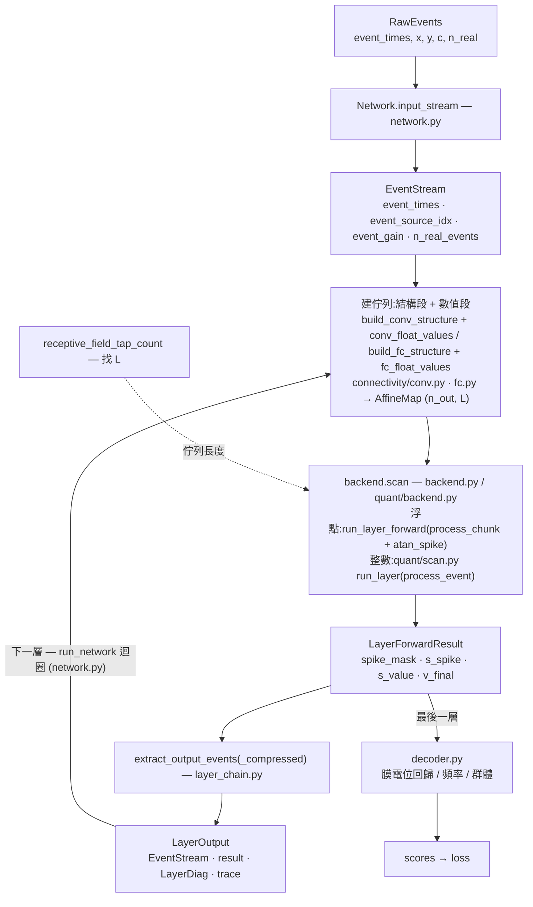
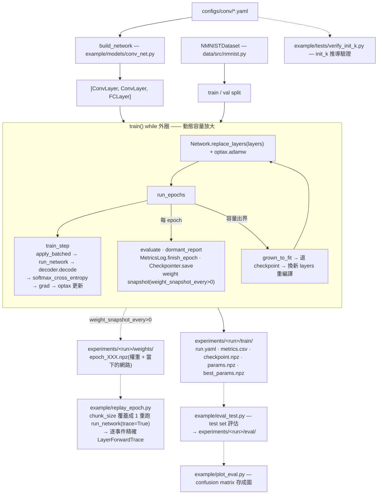

# 架構

一個網路 = 一列 layer,層與層之間流動的是「事件流」(帶時間戳的 spike)。

- **`salt_core/`** —— 核心運算,自成封閉系統,不依賴 `data/` / `example/`。
- **`example/`** —— 拿 `salt_core` + `data` 組一個實際能訓練的模型的**範例**;換資料集 / 換架構改這裡,`salt_core/` 不動。

---

## 1. `salt_core/` —— 核心

### 資料流

### 分層(按抽象層級切,不按 conv / FC 切)

1. **神經元行為 + 跑一層** —— `core.py` / `chunk_scan.py` / `surrogate.py`。
   一份共用模擬器(漏電、累加、放電、soft reset),不知道也不需要知道 conv / FC。
2. **每種 layer 怎麼從輸入 + 權重算自己的東西** —— `connectivity/conv.py`(壓縮佇列)· `connectivity/fc.py`。
   conv / FC 在這裡做的事本質不同,就讓它們不同;只在「吐出的形狀 `(n_out, L)` 的 `AffineMap`」上一致。
3. **層間接線** —— `layer_chain.py`。
   每個 layer 自己把 forward 結果吐成標準 `EventStream`;壓縮版的 local→global 索引查表收在函式內,不外洩成呼叫端的參數。
   **不是一個認識所有 layer 配對的萬能轉接器。**
4. **組網路** —— `network.py` 的 `Network` / `run_network`(從 yaml 組出 `Network` 的是 `example` 的 `build_network`)。
   吃一列 layer 把輸入流一層層轉換到底。加 pooling / residual / 新 layer 型別 = 照 `Layer` 約定寫一個新層物件,組裝邏輯一行不動。
   逐層超參(門檻 / `alpha` / `chunk_size` / init 尺度 / 容量)是**每個 layer 自己的欄位**,不是巨型 config 裡的一堆純量。

### `EventStream` —— 唯一的跨層約定

四欄:`event_times` · `event_source_idx` · `event_gain` · `n_real_events`。

`event_gain` 帶上一層每個 spike 事件自己 fire 那一刻的可微分強度 `s_spike`(forward 精確 = 1)——
下一層用離散 `event_source_idx` 從權重 gather,這條路徑對上一層權重的梯度天生是 0,`event_gain` 把它接回來(見 `docs/問題紀錄.md`)。

另加一份固定的 `LayerDiag`(spike 數 · firing rate · 佇列出界訊號 · 輸出上界出界訊號),每層 forward 都吐同樣這一份。

### 輸出編碼 = 可替換的解碼器

`decoder.py` 三種:膜電位回歸 / 頻率 / 群體,共同介面 `decode(LayerForwardResult) -> (scores, metrics)` + `validate(last_layer)`。

- 最後一層是**普通 layer**,沒有特殊型別;「不 fire / 純積分」只是它的門檻設定(`v_th = 1e9`)。
- 真正承重的介面是 `LayerForwardResult`(`v_final` · `s_value` · `spike_mask`);想要別的編碼,寫一個新解碼器,或直接在 loss_fn 裡讀 —— 解碼器不是唯一出口。

### layer 的自我初始化

- **找 L**(壓縮佇列長度):`receptive_field_tap_count` 純幾何 primitive + 訓練中偵測出界動態放大(`ConvLayer.grown_to_fit`)。
- **找 init_k**(初始權重尺度):**必填欄位,不校準**,委定值見 `docs/問題紀錄.md` §12(firing-rate 目標帶準則廢棄,固定
  `init_k = 5.0`,推導與實測見 `docs/math/初始權重尺度推導.md`)。自動找 k 的搜尋管線(舊 `calibrate.py`)已移除;
  `ConvLayer.calibration_measure` 這個量測 primitive 還留著,給 `example/tests/verify_init_k.py` 的獨立數值驗證用。

### 檔案

| 檔案 | 職責 |
|---|---|
| `core.py` | 單狀態仿射 LIF:`AffineMap` / `combine` / `process_chunk`(associative scan 內核)/ `mask_pad_events` |
| `chunk_scan.py` | `run_layer_forward` —— chunk 化序列迴圈,吐 `LayerForwardResult`;`run_layer_forward_traced`(共用內核,多疊逐步 `(v_steps, pointer)` 裸陣列,debug probe 用) |
| `surrogate.py` | `atan_spike` —— forward heaviside、backward ATan(`jax.custom_vjp`) |
| `connectivity/fc.py` | `build_fc_structure`(結構段:Δt、來源神經元,只看事件)+ `fc_float_values`(浮點數值段:仿射映射) |
| `connectivity/conv.py` | `build_conv_structure`(結構段:每個空間位置的壓縮佇列、Δt、kernel 位置,只看事件)+ `conv_float_values`(浮點數值段:仿射映射)+ `tile_channels`(空間位置 → 逐神經元) |
| `layer_chain.py` | `EventStream` + `extract_output_events` / `extract_output_events_compressed` |
| `layers.py` | `ConvLayer` / `FCLayer`(frozen dataclass;單一 `forward(params, in_stream, *, backend, trace)` 回傳 `LayerOutput`) |
| `network.py` | `RawEvents`(`checked` 在 host 端檢查時間)· `Network(input_shape, layers)`(建構時檢查接線;`init` / `input_stream` / `apply` / `apply_batched` / `replace_layers`)· `run_network`(吃 `backend` / `trace`,回傳 `NetworkOutput`:每層 `results` / `diags` / `traces`)· `check_layer_connections` |
| `io.py` | 網路描述 ↔ dict(`network_to_dict` / `network_from_dict`,含容量)· 權重連同網路描述存讀(`save_weights` / `load_weights`,npz:每層一個陣列 + `__network__`)· `weights_to_arrays` / `weights_from_arrays`(checkpoint 共用) |
| `backend.py` | `FloatBackend` / `FLOAT`:浮點數值段 + surrogate 掃描;`ScanOutput`(backend 回給層的東西) |
| `quant/backend.py` | `QuantBackend(round_mode)`:取整數權重碼(層的 `gather_weight_codes`)、衰減查表、整數掃描,`readout` 把 `v_final` 換回物理尺度;`QuantizedLayerParams` |
| `quant/scan.py` | 整數掃描:`process_event`(一筆事件的整數單步更新)/ `run_layer(_traced)`(一步一筆事件),回傳 `QuantLayerResult` |
| `quant/fixed_point.py` | 定點數運算電路的整數模擬(移位捨入 `RoundMode`、拆高低兩半的寬乘法、暫存器溢位處理 `OverflowMode` 繞回/飽和);`process_event` 用 |
| `quant/codes.py` | 離線整數碼:權重碼 `quantize_to_int`、衰減整數查表、整數門檻 `v_th_to_int`、$i_V$ 位元數公式 |
| `quant/ptq.py` | 權重的訓練後量化:`fake_quantize_tensor` / `quantization_error` / `quantize_params` |
| `quant/convert.py` | 浮點模型 + 量化規格 → 每層 `QuantizedLayerParams`(`build_quantized_params`) |
| `quant/calibrate.py` | 從軌跡量每層逐 channel 的膜電位範圍,給 `convert` 算 $i_V$ |
| `decoder.py` | 三種解碼器 + `validate` |
| `dormant.py` | `dormant_score`(逐神經元 `(n,)` 活動量 → dormant 統計,純歸約);挑層、跑探測批的 `dormant_report` 在 `example/dormant.py` |
| `monitor.py` | `LayerForwardTrace`(逐步軌跡包,兩種 backend 共用)+ `resolve_ms_*`(掃描步指標 → 真實毫秒);`run_network(..., trace=True)` 用,不進訓練熱路徑 |

---

## 2. `example/` —— 組裝範例

`example/` 不是核心的一部分,是「拿 `salt_core` + `data` 組一個實際能訓練 N-MNIST 的模型」的範例。

### 流程

- `configs/conv/*.yaml` 決定網路形狀 → `build_network` 吐 `Network`(空間尺寸 / `ic` 串接 / FC `n_in` 全由 builder 推導)。
- `NMNISTDataset` 切 train / val。
- `train()` 的 **while 外圈 = 動態容量放大控制系統**:`run_epochs` 跑訓練;某 batch 壓縮佇列或輸出上界出界 → `grown_to_fit` 放大該層 → 退回最近的 checkpoint → 換新 layer list 重編譯續練。
- `run_epochs` 內圈:每 batch 算 loss(`apply_batched → run_network → decoder.decode → softmax_cross_entropy`)+ 梯度 + `optax` 更新;每 epoch 跑 val 評估(`example.utils.make_evaluate`)+ `dormant_report` + `MetricsLog.finish_epoch` + `Checkpointer.save`。
- 輸出分三個子資料夾,各自獨立(名字定在 `example/utils.py` 的 `TRAIN_DIRNAME`/`WEIGHTS_DIRNAME`/`EVAL_DIRNAME`):
  - `experiments/<run>/train/`:`run.yaml`(config 快照 + git commit + 結束時的網路描述 + 最佳指標)· `metrics.csv` · `checkpoint.npz` · `params.npz` · `best_params.npz`(一定會寫)。
  - `experiments/<run>/weights/`:逐 epoch 權重快照,帶那個 epoch 當下的網路(`train.weight_snapshot_every > 0` 才有),給 `example/replay_epoch.py` 事後精確重現用。
  - `experiments/<run>/eval/`:`eval_test.py`/`plot_eval.py` 的事後評估輸出(跑了才有)。

### 檔案

| 檔案 | 職責 |
|---|---|
| `models/conv_net.py` | `build_network`(yaml → `Network`)/ `build_growth_policies` / `build_decoder` |
| `dormant.py` | `dormant_report`:在固定探測批上量指定層的 dormant 比例,出界時放大重算(歸約用 `salt_core.dormant.dormant_score`) |
| `train_conv_compressed.py` | 訓練 entrypoint:`train()` · `run_epochs` · 動態放大 while 外圈 |
| `metrics_log.py` | `MetricsLog` —— 逐 epoch 指標 → `train/metrics.csv` |
| `replay_epoch.py` | 讀 `weights/epoch_XXX.npz`(自帶那個 epoch 的網路),把 `chunk_size` 覆蓋成 1,重跑 `run_network(..., trace=True)` 拿逐事件精確的 `LayerForwardTrace`(見 `docs/監測規格.md` §7)。獨立 entrypoint |
| `checkpoint.py` | `Checkpointer` —— 網路描述 / params / opt_state / shuffle_key / epoch 存讀 |
| `eval_test.py` | 獨立 entrypoint:從 `experiments/<run>/train/` 讀權重(自帶網路)+ test / val 評估(accuracy / loss / confusion matrix / preds),寫進 `experiments/<run>/eval/` |
| `plot_eval.py` | 讀 `eval/<which>.yaml` 把 confusion matrix 畫成圖,存回 `eval/<which>_confusion.png` |
| `paths.py` | repo 根 / dataset / experiments 路徑 |
| `utils.py` | seed / git commit hash、`make_evaluate`(訓練 val 檢查跟 `eval_test.py` 共用)、`load_run_record`/`load_run_params`(run 紀錄、權重連同自帶的網路)/`weight_snapshot_path`、`split_raw_events`/`take_raw_events`(split → `RawEvents`)、三個輸出子資料夾的名字常數 |
| `tests/verify_init_k.py` | init_k 尺度推導的數值驗證(V1–V5) |

---

## 已知限制與待辦

見 [`TODO.md`](TODO.md)。
