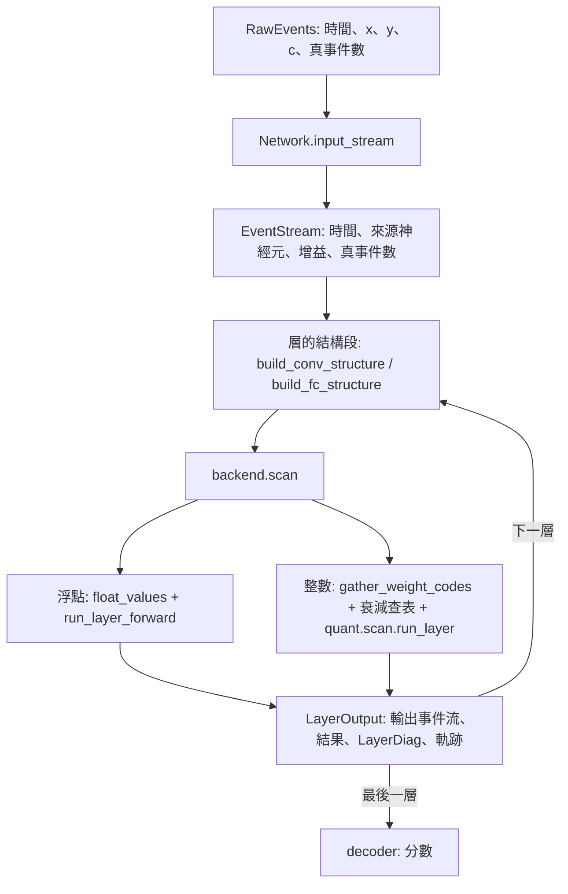
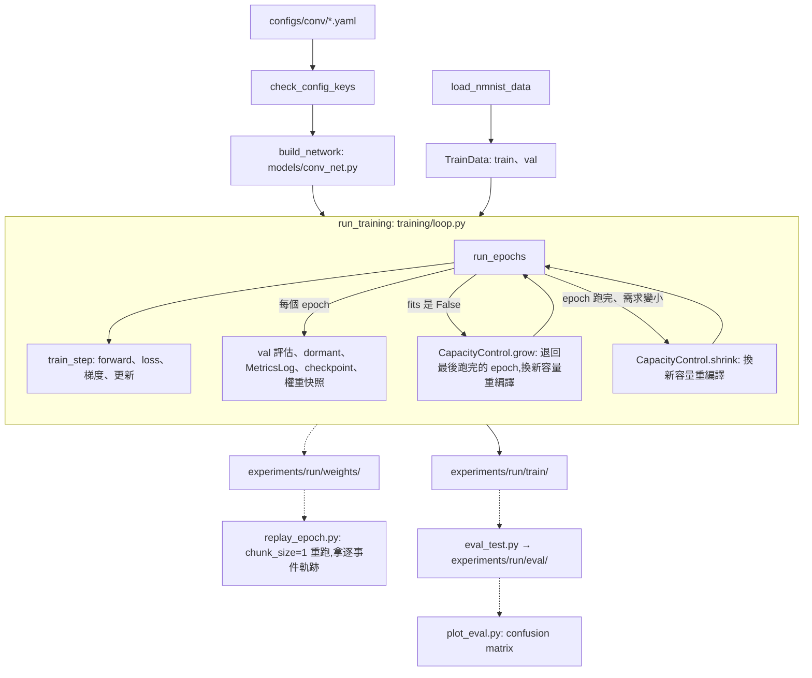

# 架構

一個網路 = 輸入網格 + 一列層,層與層之間流動的是「事件流」(帶時間戳的 spike)。

| 資料夾 | 定位 | 依賴 |
|---|---|---|
| `salt_core/` | 核心運算:層、網路、容量、浮點跟整數兩種 backend | 不依賴其他資料夾 |
| `data/` | 資料集讀取(`src/`)跟資料集視覺化(`viz/`) | 不依賴 `salt_core` |
| `viz/` | 通用繪圖:逐 epoch 曲線、網格圖、動畫 | 只有 `replay_panels.py` 依賴 `salt_core` |
| `example/` | 用 `salt_core` + `data` 組出能訓練 N-MNIST 的模型:訓練、評估、分析、notebook | 依賴以上全部 |
| `configs/` | 訓練用的 yaml(`conv/baseline.yaml`) | — |
| `archive/` | 封存的查證證據(`xla_repro/`),不維護 | — |

換資料集、換架構改 `example/`、`configs/`,`salt_core/` 不動。

---

## 1. `salt_core/`

### 資料流

`run_network` 依序跑每一層,回傳 `NetworkOutput`:每層的結果、診斷、軌跡,加上整個網路放不放得下的 `fits`。

### 分層

1. **神經元跟一層的掃描**:`float/`(浮點)、`quant/`(整數)。只看仿射映射佇列,不知道 conv、FC。
2. **每種層怎麼建佇列**:`connectivity/conv.py`、`connectivity/fc.py`。分兩段:
   - 結構段:只看事件,決定每顆神經元收哪些事件、Δt。
   - 數值段:浮點版算仿射映射(`*_float_values`),整數版取權重碼(`*_weight_codes`)。
3. **層物件**:`layers/`。把「建佇列 → backend 掃描 → 輸出事件流、診斷」收在一個 frozen dataclass 裡。
4. **網路**:`network.py` 的 `Network` / `run_network`。建構時檢查相鄰層接得起來。

加新的層型別,照 `layers/base.py` 的 `Layer` 約定寫一個層物件,`run_network` 不用改。

### 層之間的約定:`EventStream`

四欄:`event_times`、`event_source_idx`、`event_gain`、`n_real_events`。長度固定,前 `n_real_events` 筆是真事件,其餘是 pad。

`event_gain` 帶上一層每個 spike 的 `s_spike`(forward 等於 1),把下一層用離散索引查權重時斷掉的梯度接回來。理由見 `問題紀錄.md`「洞見:離散索引 gather 不會把梯度帶回「決定索引值的來源」」。

### backend

同一個層物件,換 backend 就換計算方式:

| backend | params | 掃描 |
|---|---|---|
| `float/backend.py` 的 `FLOAT` | 浮點權重 | chunk 化 associative scan,surrogate gradient |
| `quant/backend.py` 的 `QuantBackend` | `QuantizedLayerParams`(整數權重碼、衰減查表、門檻、位元寬度) | 一步一筆事件的整數遞迴,模擬 FPGA 暫存器 |

`QuantBackend.readout` 把最後一層的暫存器值換回物理尺度,給解碼器用。

### 容量

一層的陣列長度要在編譯時固定,所以每層有容量旋鈕:

| 旋鈕 | 哪種層 | 管什麼 |
|---|---|---|
| `max_queue_len` | conv | 每顆神經元的佇列長度 |
| `max_out_spikes` | conv、FC | 輸出事件流的長度 |
| `max_extra_steps` | conv、FC | 浮點掃描的額外步數:總步數 = ceil(佇列長度 / chunk_size) + 這個值 |

- 每層 forward 回傳 `LayerDiag.needed`:這筆樣本每個旋鈕需要多少。
- `Capacity.fits` 判斷放不放得下;放不下時結果可能被截斷,`NetworkOutput.fits` 是 False。
- `GrowthPolicy`、`grown_to_fit`、`shrunk_to_observed` 是放大縮小的公式;什麼時候放大縮小由呼叫端決定(`example/training/capacity_control.py`)。
- 掃描步數的推導見 `math/掃描步數上界推導.md`,旋鈕規格見 `規格書.md`「掃描步數旋鈕 `max_extra_steps`」。

### 輸出編碼

`decoder.py` 三種:膜電位回歸(讀 `v_final`)、頻率、群體(讀 `s_value`)。`validate` 檢查最後一層的門檻跟編碼配不配。最後一層是普通的層,「不 fire」只是 `v_th` 設很大。

### 檔案

最外層是 API;`connectivity/`、`float/`、`quant/`、`layers/` 的內部是實作。

| 檔案 | 內容 |
|---|---|
| `network.py` | `RawEvents`(`checked` 在 host 端檢查事件時間)、`Network`(`init` / `input_stream` / `apply` / `apply_batched` / `replace_layers`)、`run_network`、`NetworkOutput`、`check_layer_connections` |
| `layers/base.py` | `Layer` 約定、`LayerOutput`、`uniform_init` |
| `layers/conv.py` | `ConvLayer` |
| `layers/fc.py` | `FCLayer`,可以當隱藏層或輸出層 |
| `capacity.py` | `LayerDiag`、`reduce_over_batch`、`Capacity`、`GrowthPolicy`、`grown_to_fit(_batch)`、`shrunk_to_observed` |
| `io.py` | 網路描述跟 dict 互轉(`network_to_dict` / `network_from_dict`)、權重連同網路描述存讀(`save_weights` / `load_weights`) |
| `stream.py` | `EventStream`、`extract_output_events_fc` / `extract_output_events_conv` |
| `backend.py` | backend 回給層的 `ScanOutput` |
| `trace.py` | `LayerForwardTrace`(逐步軌跡,兩種 backend 共用)、`resolve_ms_fc` / `resolve_ms_conv`(掃描步 → 真實毫秒)、`summarize_trace_scalars` |
| `decoder.py` | 三種解碼器 |
| `dormant.py` | `dormant_score`:逐神經元活動量 → dormant 統計 |
| `connectivity/conv.py` | `build_conv_structure`、`conv_float_values`、`conv_weight_codes`、`tile_channels`、`unravel_conv_source` |
| `connectivity/fc.py` | `build_fc_structure`、`fc_float_values`、`fc_weight_codes` |
| `float/affine.py` | `AffineMap`、`combine`、`process_chunk`(一個 chunk 的 fire 偵測)、`mask_pad_events`;掃描步數公式 `spike_step_upper_bound`、`base_scan_steps`、`extra_steps_upper_bound` |
| `float/scan.py` | `run_layer_forward`(回傳 `LayerForwardResult`)、`run_layer_forward_traced` |
| `float/surrogate.py` | `atan_spike`:forward heaviside、backward ATan |
| `float/backend.py` | `FloatBackend` / `FLOAT` |
| `quant/codes.py` | 離線整數碼:權重碼、衰減查表、整數門檻、i_V 公式 |
| `quant/ptq.py` | 權重的訓練後量化:`fake_quantize_tensor`、`quantization_error`、`quantize_params` |
| `quant/fixed_point.py` | 定點數運算的整數模擬:移位捨入、寬乘法、溢位處理 |
| `quant/scan.py` | `process_event`(一筆事件的整數更新)、`run_layer(_traced)` |
| `quant/backend.py` | `QuantBackend`、`QuantizedLayerParams` |
| `quant/convert.py` | 浮點網路 + 量化規格 → 每層 `QuantizedLayerParams`(`build_quantized_params`) |
| `quant/calibrate.py` | 從軌跡量每層逐 channel 的膜電位範圍,給 `convert` 算 i_V |

測試在 `salt_core/tests/`,檔名對應模組(量化相關是 `test_quant_*`)。

---

## 2. `example/`

### 訓練流程

- 入口 `python -m example.train <config>`:檢查 config 的 key、讀 N-MNIST、建實驗目錄 `experiments/<run_name>_<時間戳>/`,呼叫 `train(cfg, data, exp_dir)`。資料從外面傳進 `train()`,測試換成合成資料。
- `run_training` 是外圈:容量出界時丟掉這個 batch 跟這個 epoch 已套用的更新,退回最後跑完的 epoch,放大後重編譯續練;epoch 跑完、需求明顯變小時縮小。每次放大縮小記進 `run.yaml` 的 `capacity_events`。縮小多久檢查一次由 `train.shrink_check_every` 決定。
- `run_epochs` 是內圈:每個 batch 算 loss、梯度、更新;每個 epoch 跑 val 評估、dormant 統計(`train.dormant_layers` 列的層)、寫指標、存 checkpoint。
- 行程當掉時用 `python -m example.train --resume experiments/<run>` 從 `checkpoint.npz` 接著練。

### 實驗目錄

`experiments/<run_name>_<時間戳>/`(不進 git):

| 子資料夾 | 內容 |
|---|---|
| `train/` | `run.yaml`(config 快照、git commit、續練紀錄、網路描述、最佳指標、容量事件)、`metrics.csv`、`checkpoint.npz`、`params.npz`、`best_params.npz` |
| `weights/` | 逐 epoch 權重快照 `epoch_XXX.npz`,帶那個 epoch 當下的網路(`train.weight_snapshot_every > 0` 才有) |
| `eval/` | `eval_test.py`、`plot_eval.py` 的輸出 |
| `golden/` | `analysis/golden_output.py` 的黃金輸出(只有 92.75% 那次 run 有) |

欄位說明見 `監測規格.md`「實驗目錄的輸出檔」。

### 檔案

| 檔案 | 內容 |
|---|---|
| `train.py` | 訓練入口:`train`、`check_config_keys`、`load_nmnist_data`、`--resume` |
| `training/loop.py` | `RunContext`、`TrainState`、`run_epochs`、`run_training`、`state_from_checkpoint`、`epoch_permutation` |
| `training/step.py` | `make_train_step`:forward、loss、梯度、更新,回傳 `StepOutput`(含 `fits`) |
| `training/capacity_control.py` | `CapacityControl`(什麼時候放大縮小)、`GrowEvent` / `ShrinkEvent` / `KnobChange` |
| `training/optim.py` | `build_optimizer`、`build_learning_rate`(AdamW,選配餘弦退火、梯度裁剪) |
| `training/loss.py` | `cross_entropy_loss`(選配 `score_cap`) |
| `training/run_dir.py` | 建實驗目錄、寫 `run.yaml`、權重檔 |
| `models/conv_net.py` | `build_network`(config → `Network`)、`build_growth_policies`、`build_decoder` |
| `metrics_log.py` | `MetricsLog`:逐 epoch 指標 → `metrics.csv` |
| `checkpoint.py` | `Checkpointer`、`CheckpointState`、`Best`:續練需要的全部狀態,原子寫入 |
| `dormant.py` | `dormant_report`:在固定探測批上量指定層的 dormant 比例 |
| `eval_test.py` | 在 test 或 val set 上評估一個跑完的 run |
| `plot_eval.py` | 把評估結果畫成 confusion matrix |
| `replay_epoch.py` | 讀某個 epoch 的權重快照,`chunk_size` 覆蓋成 1 重跑,拿逐事件軌跡 |
| `utils.py` | `load_config`、`set_seed`、`make_evaluate`(訓練的 val 評估跟 `eval_test.py` 共用)、`load_run_record` / `load_run_params`、`split_raw_events` / `take_raw_events`、三個實驗子資料夾的名字 |
| `paths.py` | repo 根目錄、configs、experiments 路徑 |
| `analysis/golden_output.py` | 黃金輸出的存檔跟比對(`compare`、`compare_quant`),每次重構後的數值回歸檢查 |
| `analysis/verify_init_k.py` | init_k 尺度推導的數值驗證(V1~V5) |
| `analysis/inspect_explosion_batch.py`、`weight_norm_over_epochs.py`、`weight_step_ratio.py` | 訓練中期梯度爆炸的一次性分析 |
| `notebooks/` | 一次性的視覺化跟分析:`plot_metrics`、`replay_animation`、`channel_firing_analysis`、`weight_quantization_ptq`、`membrane_quantization` |

測試在 `example/tests/`;需要訓練的測試用合成資料(`_train_runs.py`),共用一次參考訓練。

---

## 3. `data/`

| 檔案 | 內容 |
|---|---|
| `src/nmnist.py` | `NMNISTDataset`(讀 .bin、切 train/val/test、截斷跟 pad 到 `max_events`)、`NMNISTSplit`、資料集常數 |
| `viz/nmnist.py` | 資料集視覺化:累積影像、逐時間區段影像、時間分布 |
| `paths.py` | `DATASET_ROOT` |

資料集放在 `data/datasets/`(不進 git)。常數跟建構參數怎麼分,見 `問題紀錄.md`「決策:data/ 的常數只放資料集事實,實驗可調的值當建構參數」。

## 4. `viz/`

| 檔案 | 內容 |
|---|---|
| `epoch_series.py` | 逐 epoch 純量表:`read_epoch_series_csv`、`EpochSeriesPlot` |
| `channel_grid.py` | 網格圖 `ImageGridPlot`、動畫 `ChannelGridAnimation`、panel 約定 `AnimatedPanel`、`ColorOverlayPanel` |
| `time_resample.py` | 逐神經元事件時間攤成等距時間軸:`resample_pulse`、`resample_decay`、`sliding_windows` |
| `replay_panels.py` | 輸入、conv、FC 的動畫 panel(依賴 `salt_core`) |
| `style.py` | `apply_style`:中文字型,由入口程式呼叫 |

---

## 已知限制與待辦

見 [`TODO.md`](TODO.md)。
